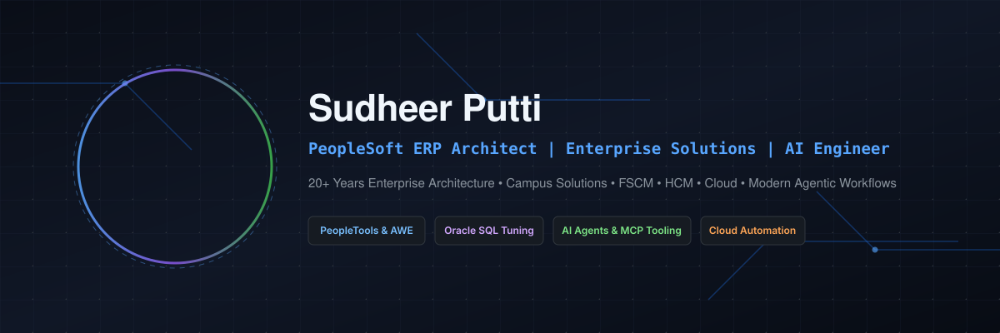

<p align="center">
  
</p>
<h1 align="center">
  Hi 👋, I'm Sudheer Putti
</h1>

<h3 align="center">
  🚀 PeopleSoft ERP Architect | Enterprise Solution Engineer | AI-Augmented Developer
</h3>

<p align="center">
  20+ Years Building Enterprise Solutions Across FSCM, HCM, Campus Solutions, Cloud & Intelligent Automation
</p>

<p align="center">
  <a href="https://www.linkedin.com/in/sudheer-putti/" target="_blank">
    
  </a>
  <a href="https://github.com/sudheersagar" target="_blank">
    
  </a>
</p>

<p align="center">
  
</p>

<p align="center">
  
  
  
  
  
  
  
  
  
</p>

<p align="center">
  
</p>

<p align="center">
  
</p>


### 💡 Who Am I?

I'm a PeopleSoft consultant and enterprise software engineer with over two decades of experience delivering implementations, upgrades, integrations, and modernization initiatives across Higher Education, Financials/Supply Chain, and Human Capital Management environments.

Today, I focus on bridging traditional ERP platforms with modern technologies: autonomous AI agents, Model Context Protocol (MCP) integrations, local LLM tooling, CI/CD automation frameworks, and zero-dependency browser developer utilities.

---

### 👨‍💻 About Me

- 🏛️ **Lead Software Engineer & PeopleSoft ERP Lead** at Maricopa Community Colleges.
- 💼 **20+ Years of Enterprise Architecture & Consulting Experience** spanning Campus Solutions (CS), Financials/Supply Chain (FSCM), and Human Capital Management (HCM).
- 🤖 **AI-Augmented Engineering:** Designing autonomous workflows, MCP integrations, local LLM runtimes (Ollama, OpenCode), and Retrieval-Augmented Generation (RAG).
- 🛠️ **Open Source Author:** Building zero-dependency, high-performance browser tools for ERP engineers.
- 🎓 **Education:** Master of Computer Applications (MCA), Osmania University.

---

### 🌟 Featured Open-Source Projects

- **[PeopleSoft Project Insights](https://github.com/sudheersagar/PSoft-Project-Insights)**  
  Single-file, client-side browser utility to parse App Designer project XML exports, inspect metadata, analyze dependencies, and document object structures instantly.

- **[PSoft Log Insights Enhanced](https://github.com/sudheersagar/PSoft-Trace-Insights)**  
  High-performance diagnostic trace analyzer providing execution flame charts, SQL bottleneck identification, and root-cause debugging without external dependencies.

- **[PeopleSoft Topics & Reference Architecture](https://github.com/sudheersagar/PeopleSoft-Topics)**  
  In-depth architectural patterns, module cross-mappings, and implementation playbooks across CS, HCM, and FSCM.

- **[PeopleSoft Tips & Troubleshooting](https://github.com/sudheersagar/PeopleSoft-Tips)**  
  Curated optimization techniques, SQL tuning references, and production battle-tested solutions for technical leads.

---

## 🎯 Current Focus

```text
✅ AI-Augmented ERP Development
✅ Agentic Workflows & MCP Integrations
✅ Enterprise Automation & Cloud Solutions
✅ Zero-Dependency Browser-Based Developer Tools
✅ Legacy ERP Modernization & Performance Tuning
```

---

## 💡 Professional Mission

> Modernizing Enterprise ERP systems with AI, Automation, Cloud Technologies, and Developer Productivity Tools.

> Bridging the gap between traditional PeopleSoft ecosystems and next-generation intelligent platforms.

---

<h3 align="center">
⭐ If you find my projects useful, consider giving them a star!
</h3>

---


<p align="center">
  
</p>

---
